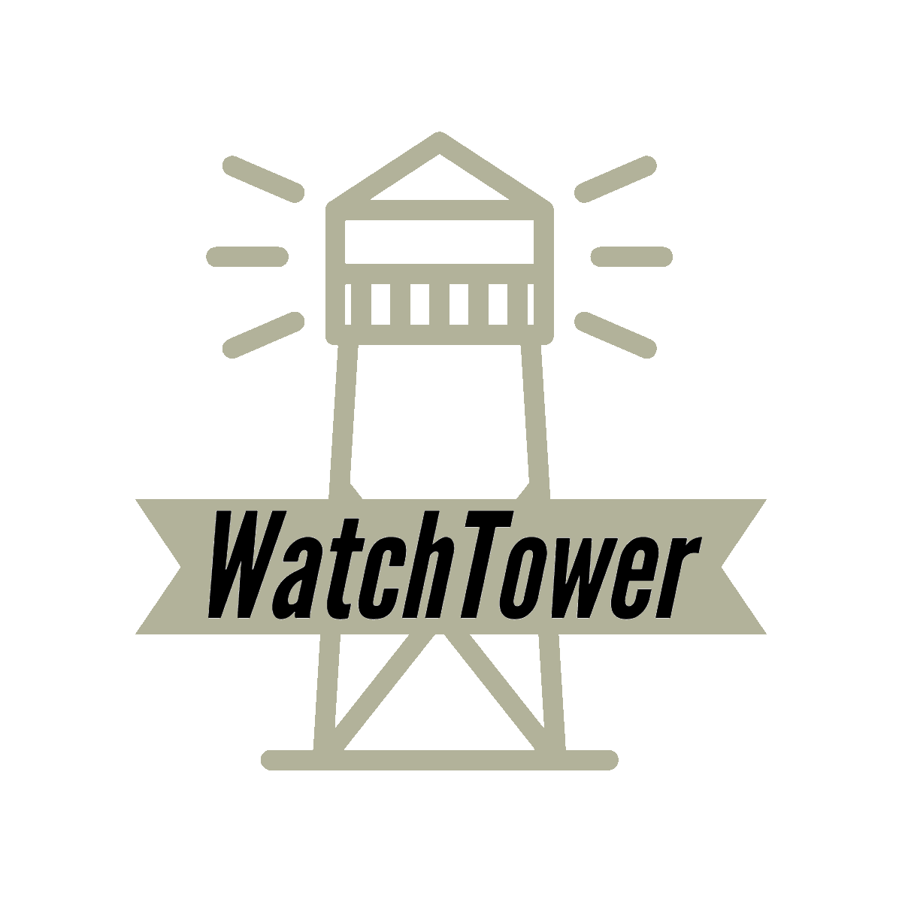

# Watchtower
***Watchtower is the app for keeping you community safe and connected***



# Installation

Follow these steps to run a local instance of the frontend of Watchtower:  
(You'll need node, npm, and a mongodb account already installed.)

The backend is on a seperate github repository with its own set of instructions.
It would be easier to start with the backend instructions and then do the front end instructions

Backend: https://github.com/martinrgarciap/watchtowerserver

1. Clone or download this repo.
#### Set up the frontend
- Install client dependencies:  
   
   Run `npm install` from inside the client directory.
   ```bash    
   $ npm install
   ```
- Set environment variables:  
   create a .env file in the root file with the following information
   replace XXXX with the port that the server side is listening on or 
   the PORT in the backend .env file. Set YYYY to the socket port number
   from the server side or the PORTSOCKET port.
   ```.env
    REACT_APP_APILINK="http://localhost:XXXX/api/user"
    REACT_APP_APILINKFORUM="http://localhost:XXXX/api/forum"
    REACT_APP_APILINKTWITTER="http://localhost:XXXX/api/twitter"
    REACT_APP_SOCKETENDPOINT="http://localhost:YYYY"
   ```
- Start the React app:
    ```bash
    $ npm start
    ```
